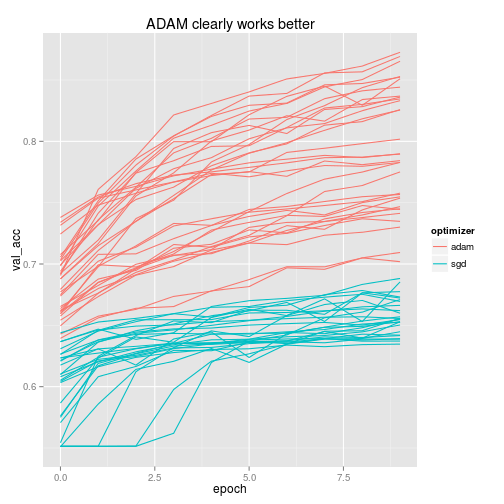
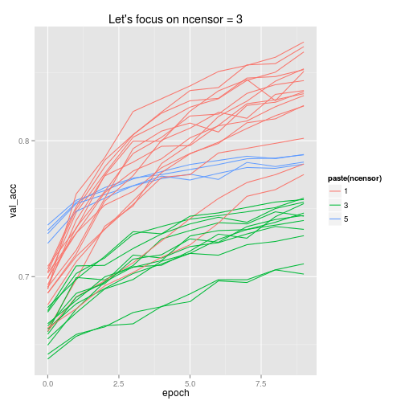
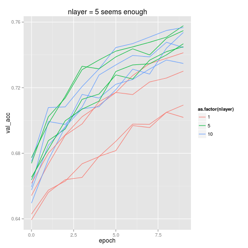
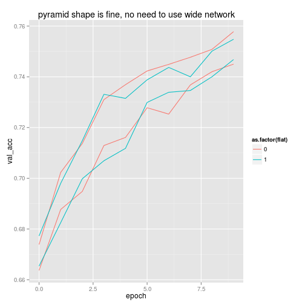
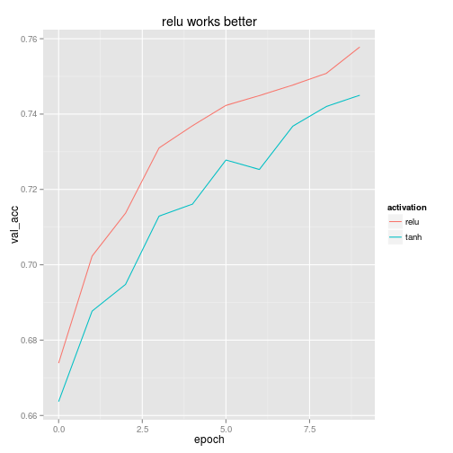

```r
require(data.table)
require(ggplot2)

dat = fread("results.csv")

dat[, params := as.factor(
          paste(optimizer
              , ifelse(batch_normalization==1, "batch_normalization", "")
              , ifelse(flat==1, "wide", "pyramid")
              , activation
              , nlayer
              , ncensor
              , trainsize))]
```

```
##           acc activation batch batch_normalization epoch flat      loss
##     1: 0.5013       relu    38                   0     0    0 0.8652601
##     2: 0.5525       relu    38                   0     1    0 0.7578590
##     3: 0.5764       relu    38                   0     2    0 0.7269384
##     4: 0.5921       relu    38                   0     3    0 0.7104613
##     5: 0.6051       relu    38                   0     4    0 0.6996000
##    ---                                                                 
## 10273: 0.6900       tanh    38                   0   111    1 0.5875142
## 10274: 0.6894       tanh    38                   0   112    1 0.5842621
## 10275: 0.6951       tanh    38                   0   113    1 0.5822382
## 10276: 0.6934       tanh    38                   0   114    1 0.5828911
## 10277: 0.6918       tanh    38                   0   115    1 0.5829664
##        ncensor nlayer optimizer size time_taken trainsize val_acc
##     1:       3      1       sgd  127   52.18558     10000  0.5357
##     2:       3      1       sgd  127   52.18558     10000  0.5617
##     3:       3      1       sgd  127   52.18558     10000  0.5804
##     4:       3      1       sgd  127   52.18558     10000  0.5964
##     5:       3      1       sgd  127   52.18558     10000  0.6074
##    ---                                                           
## 10273:       3      5       sgd  127   33.00949     10000  0.6520
## 10274:       3      5       sgd  127   33.00949     10000  0.6350
## 10275:       3      5       sgd  127   33.00949     10000  0.6536
## 10276:       3      5       sgd  127   33.00949     10000  0.6181
## 10277:       3      5       sgd  127   33.00949     10000  0.6506
##         val_loss                      params
##     1: 0.7844562 sgd  pyramid relu 1 3 10000
##     2: 0.7402002 sgd  pyramid relu 1 3 10000
##     3: 0.7197542 sgd  pyramid relu 1 3 10000
##     4: 0.7075011 sgd  pyramid relu 1 3 10000
##     5: 0.6990628 sgd  pyramid relu 1 3 10000
##    ---                                      
## 10273: 0.6256749    sgd  wide tanh 5 3 10000
## 10274: 0.6556490    sgd  wide tanh 5 3 10000
## 10275: 0.6246955    sgd  wide tanh 5 3 10000
## 10276: 0.6904627    sgd  wide tanh 5 3 10000
## 10277: 0.6367899    sgd  wide tanh 5 3 10000
```

```r
dat = dat[trainsize == 1000000]

qplot(epoch, val_acc, geom = "line"
    , col = optimizer
    , group = params
    , data = dat
    , main = "ADAM clearly works better")
```

 

```r
dat = dat[optimizer == "adam"]

qplot(epoch, val_acc, geom = "line"
    , col = paste(ncensor)
    , group = params
    , data = dat
    , main = "Let's focus on ncensor = 3")
```

 

```r
dat = dat[ncensor == 3]

qplot(epoch, val_acc, geom = "line"
    , col = as.factor(nlayer)
    , group = params
    , data = dat
    , main = "nlayer = 5 seems enough")
```

 

```r
dat = dat[nlayer == 5]

qplot(epoch, val_acc, geom = "line"
    , col = as.factor(flat)
    , group = params
    , data = dat
    , main = "pyramid shape is fine, no need to use wide network")
```

 

```r
dat = dat[flat == 0]

qplot(epoch, val_acc, geom = "line"
    , col = activation
    , group = params
    , data = dat
    , main = "relu works better")
```

 

```r
require(knitr)
```

